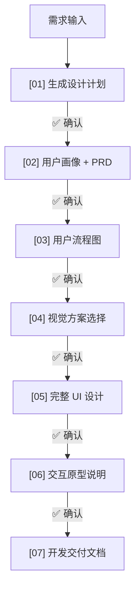

作为一名产品经理，你是否曾被这些琐事缠身：
- 写了 30 页 PRD，结果逻辑漏洞百出？
- 想要一个简单的原型图，却要等设计排期两周？
- 进入开发阶段，前端同学跑来问你：这个按钮点击后的 Loading 状态是什么样？

今天，我想分享一份我最近沉淀的 **“产品设计全流程自动化 Skill”**。这份 Skill 不是简单的 Prompt 堆砌，而是一个具有**分步确认机制**的自动化工作流，它让 AI 真正具备了一个“资深产品+初级设计”的综合能力。

## 核心逻辑：七步成诗

这个 Skill 将产品设计拆解为 7 个可标准化的阶段，每个节点都设置了 **“确认点”**。AI 不会一口气跑到底，而是在关键决策点询问你，确保方向不跑偏。

### 1. 计划先行：避免“南辕北辙”
在开始画图前，AI 会先出一份《设计计划》，明确产品定位、目标用户和包含的模块优先级。只有在这个阶段达成共识，后续的生成才会有意义。

### 2. PRD 与画像：理解“谁在用”
这一步 AI 会生成详细的用户故事。例如：
> “作为[主要用户]，我想要[功能]，以便[目的]。”
结合验收标准（AC），这份 PRD 可以直接作为后续开发的逻辑蓝图。

### 3. 可视化逻辑：Mermaid 流程图
AI 会自动将 PRD 里的业务逻辑转化为 Mermaid 代码生成的流程图。直观的图表往往比几千字的说明更能发现逻辑死角。

### 4. 视觉方案的三种可能
在进入高保真设计前，Skill 会提供 A/B/C 三套视觉规范。
- **方案 A**：清简墨韵（极简、商务）
- **方案 B**：活力渐变（时尚、社交）
- **方案 C**：沉浸暗黑（游戏、科技）
你可以选定一套，AI 随后的 UI 生成将严格遵守这套规范。

### 5. 像素级还原：HTML 高保真 UI
这是最令人惊叹的部分。基于选定的规范，AI 能够直接输出高保真的页面 HTML，包含真实的内容、标准的间距和组件状态。

### 6. 交互说明：填补“静态”的坑
“点击按钮后是侧滑进入还是淡入淡出？”、“空状态是什么样？”
这些细节都在阶段六的《交互原型说明》中被一一补齐。

### 7. 开发交付：不仅仅是前端
最后的产出物是一份《开发交付文档》，它不仅给前端看（样式令牌、组件状态），更给后端看（接口字段定义、数据模型设计、异常处理规范）。

## 为什么这种“确认机制”很重要？

在过去，我们常抱怨 AI 会“产生幻觉”或者输出内容不可控。通过这种 **“小步快跑、阶段确认”** 的机制，我们实际上是将“控制权”留在了人手里，而将“生产力”托付给了 AI。

这种工作流带来的是：
- **一致性**：UI 规范、逻辑文档和接口说明是一体成型的，不会出现“货不对板”。
- **透明度**：你可以清楚地看到 AI 是如何从一个模糊的需求点，推导出最后的数据库表结构的。
- **极速迭代**：完成全套方案的时间从“周”缩短到了“小时”。

## 结语

未来，一个优秀的产品经理可能不再需要亲自操作 Figma，但他必须能够编写和维护像这样的“工作流 Skill”。

AI 正在从一个“聊天伴侣”变成一个“专业插件”。你准备好把你的设计流程“Skill 化”了吗？

---
> 提示：如果你对这个 `product-design-flow.skill` 感兴趣，欢迎留言交流，下期分享具体如何构建这类高阶 Agent 组件。
