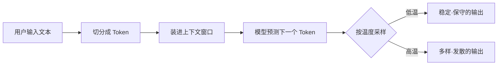

> 这是"AI 碎碎念"的第一篇文章。作为一个产品经理，我会用最少的术语，最直白的语言，把一个我曾经搞混过的 AI 概念讲清楚。

每次聊到大语言模型（LLM），总有三个词会被混着用：**Token、上下文窗口、温度**。
真正理解它们，你读任何一篇 AI 产品文档、看任何一次发布会，都不会再被术语绊倒。

## 一、Token：模型眼中的"字"

Token 不是"单词"，也不是"字"，而是模型把文本切成的最小处理单元。
对英文来说，一个 token 大约是 0.75 个单词；对中文来说，一个汉字通常就是 1 个 token，有时候一个常用词会合并成 1 个 token。

举个直观的例子：

```text
"我爱 AI"    →  大约 3 个 token
"Hello!"     →  2 个 token（Hello + !）
```

**为什么你需要关心 token？**

因为模型的定价是按 token 收钱的，模型的"记忆容量"也是按 token 算的。
当别人说"这个模型 128k 上下文"，意思就是它一次最多能看 128,000 个 token。

## 二、上下文窗口：模型能一次"看见"多少

上下文窗口（Context Window）是模型一次能处理的 token 总数上限，**包括你输入的内容 + 它输出的内容**。

可以把它想象成一张桌面：
- 桌面大 = 一次能摊开的纸多 = 能塞进更长的资料
- 桌面满了 = 新的纸进来，旧的纸就会掉下去（或者模型直接拒绝）

这就是为什么 **RAG（检索增强生成）** 会出现：
当你的知识库远大于上下文窗口时，不能一股脑全塞进去，而要先"检索出相关的几页纸"再塞。

## 三、温度：决定回答的"保守度"

温度（Temperature）是采样参数，控制模型输出的随机性，取值通常在 0 到 2 之间。

从概率视角看，模型预测下一个 token 时其实是在一个分布上做采样：

$$
P(\text{token}_i) = \frac{\exp(z_i / T)}{\sum_j \exp(z_j / T)}
$$

其中 $T$ 就是温度。

- $T \to 0$：几乎总是选概率最高的那个 token → 答案稳定、严谨、略呆板
- $T = 1$：保持原始概率分布 → 平衡
- $T \to 2$：概率被拉平，低概率 token 也有机会 → 答案更有创意，但也更容易胡言乱语

**什么时候用什么？**

| 场景 | 建议温度 |
| --- | --- |
| 写代码、做摘要、抽取结构化数据 | 0 ~ 0.3 |
| 普通对话、问答 | 0.5 ~ 0.8 |
| 创意写作、头脑风暴 | 0.9 ~ 1.3 |

## 一张图串起来



## 最后

这三个概念不是全部，但它们是一切 LLM 讨论的地基。
下一篇我想聊一聊——为什么同一个模型，同样的问题，加了一句"让我们一步步思考"，答案就能变得明显更好？

欢迎留言交流，也欢迎指正错误。这里的内容会保持慢更新，但每一篇都争取能让你"恍然大悟"那么一下。

—— Jimmy
